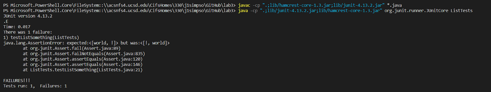

# Week 3 Lab Report

## Part 1: Simplest Search Engine

Here is the world simplest search engine coded in java, with this being the SearchEngine.java file.
```
import java.io.IOException;
import java.net.URI;
import java.util.ArrayList;

class Handler implements URLHandler{
    ArrayList<String> apps = new ArrayList<String>();

    public String handleRequest(URI url){
        if(url.getPath().equals("/")){
            return "Home Page";
        } 
        else if(url.getPath().equals("/add")){
            String[] parameters = url.getQuery().split("=");
            if(parameters[0].equals("s")){
                apps.add(parameters[1]);
                return "App Added!";
            }
        }
        else if(url.getPath().contains("/search")){
            String[] parameters = url.getQuery().split("=");
            if(parameters[0].equals("s")){
                if(parameters[1].equals("app")){
                    String appList = String.join(", ", apps);
                    return appList;
                }
            }
        }
        return "404, Not Found";
    }
}

class SearchEngine{
    public static void main(String[] args) throws IOException{
        if(args.length == 0){
            System.out.println("Missing port number! Try any number between 1024 to 49151");
            return;
        }

        int port = Integer.parseInt(args[0]);

        Server.start(port, new Handler());
    }
}
```
To start with this simple search engine, we first take in a URL which the user has put in. For this example, we have the path which is everything after the `/` character. After that, the query, which is after the `?` character is also processed.

The method `handleRequest(URI url)` is responsible for separating out what the user has input, and create a page which represents what the user has done. Below is the default page, when the user only visits with the path "/".


The first if statement is responsible for this page, as the code does: `if(url.getPath().equals("/"))`. Which in this case it is, since the default page is "/". The only thing that is returned is the string "Home Page". This is great but the user hasn't really interacted with anything. In this next step we will add an app:


The URL above looks different than before, we are in the same domain, but after we have `/add?s=donut`. In the code we do the same before to check the path, which is `/add` in this case. After that we need to check the query that the user has input. This is done by taking the query with `url.getQuery()` and splitting the text returned by the delimiter "=". Creating an array with all the paramters put in. In this case the first parameter is right after the "?", which is just the letter s. This is checked in the code seeing if `parameter[0]` is s. If it's that then the second paramater is the name of the new app added. 

Last, we would want to see the apps we added:


With the last search, we take the user input in the same method as the previous, but instead the only thing different is the path and the query needed to show this page, which is: `/search?s=app`. The program will then take all of the apps added and return a string of all of them. This is done with an ArrayList called apps, and joining all of them together with the `join()` method.

---
## Part 2: Testing code for bugs

We all would like to think we are writing perfect code in the moment, though thats probably not the case. Programmers need to test their code, as computers are unforgiving in following the instructions they are given.

Lets start with arrays, and a method called reversed:
```
static int[] reversed(int[] arr) {
  int[] newArray = new int[arr.length];
  for(int i = 0; i < arr.length; i += 1) {
    arr[i] = newArray[arr.length - i - 1];
  }
  return arr;
}
```
This method looks good at first glance, though lets test it:
```
@Test
public void testReversedSimple(){
  int[] input1 = {1,2,3};
  int[] output1 = ArrayExamples.reversed(input1);
  assertArrayEquals(new int[]{3,2,1}, output1);
}
```
Should work right?
```
There was 1 failure:
1) testReversedSimple(ArrayTests)
arrays first differed at element [0]; expected:<3> but was:<0>
        at org.junit.internal.ComparisonCriteria.arrayEquals(ComparisonCriteria.java:78)
        at org.junit.internal.ComparisonCriteria.arrayEquals(ComparisonCriteria.java:28)
        at org.junit.Assert.internalArrayEquals(Assert.java:534)
        at org.junit.Assert.assertArrayEquals(Assert.java:418)
        at org.junit.Assert.assertArrayEquals(Assert.java:429)
        at ArrayTests.testReversedSimple(ArrayTests.java:36)
        ... 32 trimmed
Caused by: java.lang.AssertionError: expected:<3> but was:<0>
        at org.junit.Assert.fail(Assert.java:89)
        at org.junit.Assert.failNotEquals(Assert.java:835)
        at org.junit.Assert.assertEquals(Assert.java:120)
        at org.junit.Assert.assertEquals(Assert.java:146)
        at org.junit.internal.ExactComparisonCriteria.assertElementsEqual(ExactComparisonCriteria.java:8)
        at org.junit.internal.ComparisonCriteria.arrayEquals(ComparisonCriteria.java:76)
        ... 38 more

FAILURES!!!
Tests run: 5,  Failures: 1
```

What went wrong? Look at the line `arrays first differed at element [0]; expected:<3> but was:<0>` and we can start to understand what might be going here. If the reversed list has a 0 in it, then it might not be assigned right, since the original list doesn't have 0.

Lets look at the line `arr[i] = newArray[arr.length - i - 1]` and understand what it's doing. We are assigning the i'th index of arr to the value of `newArray[arr.length - i - 1]`. What does newArray contain? The last thing we did with it was just initialize it with `int[] newArray = new int[arr.length]`. The contents are all 0 and we are assigning 0's into the array we are returning. This leads to the symptom being the return array will be all 0's. So, how do we fix this?

Lets change the assignment so that instead we are assigning values from the array given into newArray: `newArray[i] = arr[arr.length - i - 1]`. As well at the end, we must change the return statement to make sure it returns newArray. Here is the fixed code for reversed:
```
static int[] reversed(int[] arr) {
  int[] newArray = new int[arr.length];
  for(int i = 0; i < arr.length; i += 1) {
    newArray[i] = arr[arr.length - i - 1];
  }
  return newArray;
}
```

---
Moving on to another method that deals with lists, and has a small bug inside of it. Lets take a look at the method filter:
```
// Returns a new list that has all the elements of the input list for which
// the StringChecker returns true, and not the elements that return false, in
// the same order they appeared in the input list;
static List<String> filter(List<String> list, StringChecker sc) {
  List<String> result = new ArrayList<>();
  for(String s: list) {
    if(sc.checkString(s)) {
      result.add(0, s);
    }
  }
  return result;
}
```
We should expect this to filter a list of strings and return it in the same order that it was given. Before we test, we need to setup a couple of things, the StringChecker interface must be setup before we run a test.

```
public class StringCheckerTests implements StringChecker{
    public boolean checkString(String s){
        if(!s.equals("hello")){
            return false;
        }else{
            return true;
        }
    }
}
```

This is the implementation that was created to test our method. This simply implements the StringChecker and will check if it equals the string `"hello"`. If it does it will return false and otherwise will return true. This should effectively remove the word hello from the list. Lets test it:

```
@Test
public void testListSomething(){
    List<String> stringArray = new ArrayList<>();
    stringArray.add("hello");
    stringArray.add("world");
    stringArray.add("!");

    StringChecker sc = new StringCheckerTests();
    List<String> newStringArray = ListExamples.filter(stringArray, sc);

    List<String> expected = new ArrayList<>();
    expected.add("world");
    expected.add("!");
    assertEquals(expected, newStringArray);
}
```


Here the output isn't exactly what we wanted, we got `["!", "hello"]` and not what we were expecting: `["world", "!"]`. The order is reversed, which tell us that we are putting the strings in the wrong place of the arraylist. 

Lets take a look at the line where we insert elements into our array in the filter method: `result.add(0, s)`. Here we are adding all of our elements to the 0'th index always. This would be good but this causes all previous entered elements to right shift, let me explain by running step by step what the code is doing:

We know that we are going to try to add these strings: "hello", "world", "!",
the first string hello will not be added since the StringChecker will return false, which means are adding "world" and "!" in order.

After we have added the string "world" to our result list it looks like this:
`["world"]`, now lets add the string "!", this has to go in the 0'th element so the string world is right shifted: `["!", "world"]`. This isn't what we wanted! How do we fix this? We need to changed where were are adding to our result list. The way to do this is change `result.add(0,s)` to `result.add(s)`. This will add the string to the last place of the result list, which means we keep order as we add on our strings. The fixed code looks like this:

```
static List<String> filter(List<String> list, StringChecker sc) {
  List<String> result = new ArrayList<>();
  for(String s: list) {
    if(sc.checkString(s)) {
      result.add(s);
    }
  }
  return result;
}
```

Which returns the expect result `["world","!"]`.