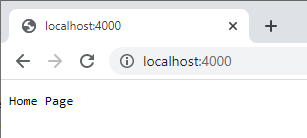
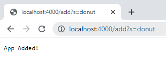
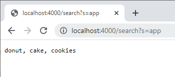

# Week 3 Lab Report

## Part 1: Simplest Search Engine

Here is the world simplest search engine coded in java, with this being the SearchEngine.java file.
```
import java.io.IOException;
import java.net.URI;
import java.util.ArrayList;

class Handler implements URLHandler{
    ArrayList<String> apps = new ArrayList<String>();

    public String handleRequest(URI url){
        if(url.getPath().equals("/")){
            return "Home Page";
        } 
        else if(url.getPath().equals("/add")){
            String[] parameters = url.getQuery().split("=");
            if(parameters[0].equals("s")){
                apps.add(parameters[1]);
                return "App Added!";
            }
        }
        else if(url.getPath().contains("/search")){
            String[] parameters = url.getQuery().split("=");
            if(parameters[0].equals("s")){
                if(parameters[1].equals("app")){
                    String appList = String.join(", ", apps);
                    return appList;
                }
            }
        }
        return "404, Not Found";
    }
}

class SearchEngine{
    public static void main(String[] args) throws IOException{
        if(args.length == 0){
            System.out.println("Missing port number! Try any number between 1024 to 49151");
            return;
        }

        int port = Integer.parseInt(args[0]);

        Server.start(port, new Handler());
    }
}
```
To start with this simple search engine, we first take in a URL which the user has put in. For this example, we have the path which is everything after the `/` character. After that, the query, which is after the `?` character is also processed.

The method `handleRequest(URI url)` is responsible for separating out what the user has input, and create a page which represents what the user has done. Below is the default page, when the user only visits with the path "/".



The first if statement is responsible for this page, as the code does: `if(url.getPath().equals("/"))`. Which in this case it is, since the default page is "/". The only thing that is returned is the string "Home Page". This is great but the user hasn't really interacted with anything. In this next step we will add an app:



The URL above looks different than before, we are in the same domain, but after we have `/add?s=donut`. In the code we do the same before to check the path, which is `/add` in this case. After that we need to check the query that the user has input. This is done by taking the query with `url.getQuery()` and splitting the text returned by the delimiter "=". Creating an array with all the paramters put in. In this case the first parameter is right after the "?", which is just the letter s. This is checked in the code seeing if `parameter[0]` is s. If it's that then the second paramater is the name of the new app added. 

Last, we would want to see the apps we added:




With the last search, we take the user input in the same method as the previous, but instead the only thing different is the path and the query needed to show this page, which is: `/search?s=app`. The program will then take all of the apps added and return a string of all of them. This is done with an ArrayList called apps, and joining all of them together with the `join()` method.

## Part 2: Testing code for bugs

We all would like to think we are writing perfect code in the moment, though thats probably not the case. Programmers need to test their code, as computers are unforgiving in following the instructions they are given.

Lets start with arrays, and a method called reversed:
```
  static int[] reversed(int[] arr) {
    int[] newArray = new int[arr.length];
    for(int i = 0; i < arr.length; i += 1) {
      arr[i] = newArray[arr.length - i - 1];
    }
    return arr;
  }
```
This method looks good at first glance, though lets test it:
```
  @Test
  public void testReversedSimple(){
    int[] input1 = {1,2,3};
    int[] output1 = ArrayExamples.reversed(input1);
    assertArrayEquals(new int[]{3,2,1}, output1);
  }
```

