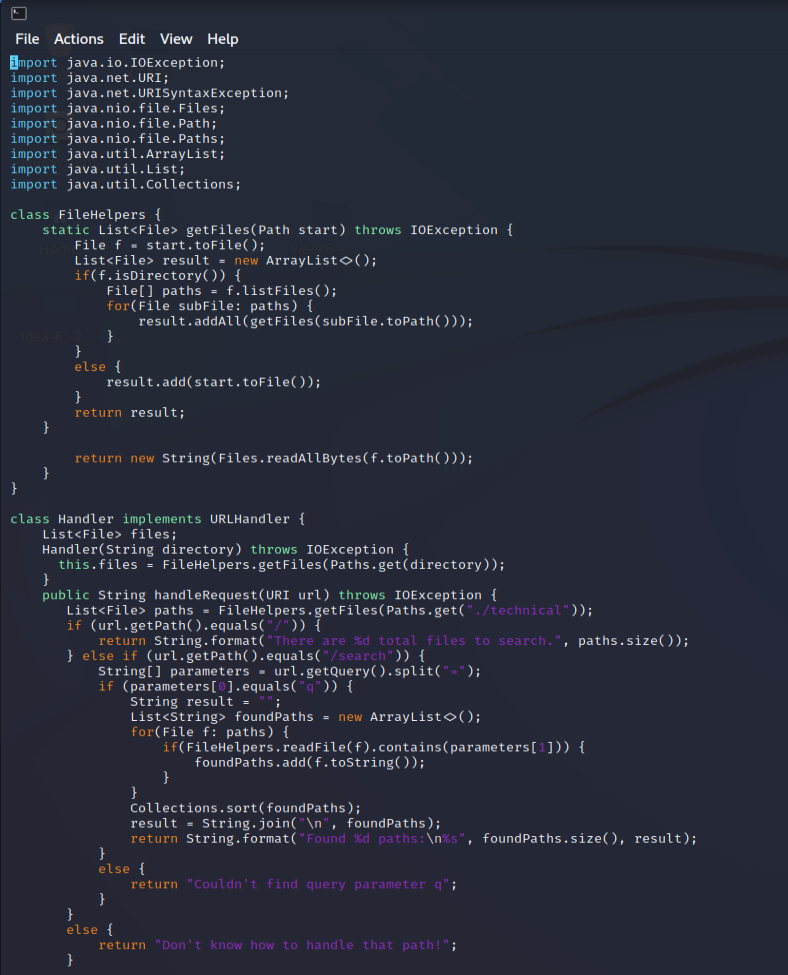
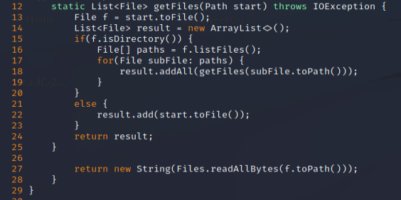
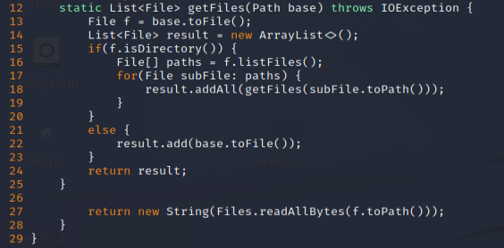

# Making the most of VIM
In this lab we will be showing how to make an edit quickly on VIM, the editor in many computers that can be used from the command line/terminal.

Lets take a look at the file we will be doing a quick edit on today. Doing `vim DocSearchServer.java` will let us open the file from the command line.


Suppose we do not like the getFiles parameter name start, and would rather see it be named 'base'. This is very easy in vim.
We will start with the default vim normal mode. Here we can do many things to go into other modes and nice commands.
The first thing I want to do in this case is see the line numbers. We can do this with `:set number`. 



Now on the left hand side we can see the numbers on the left for the count of the lines in the code. This will be useful for our next commands. With this, we can easily do a find and replace command on vim, and change our words. We can use the `:s` command to do this. The form of command that I will use will be of: `:start, end s/"search"/"replace"/g`. The `g` the end is the global option which tells vim to edit the whole line, instead of the first occurance only. So, I will show what the command `:12,29 s/start/base/g` can do for us: 



Now it looks like how we want our code to look. The only two things used here were `:set number` (or `:set nu`) and `:12,29 s/start/base/g`, with the first command being for informational purposes so we can cutoff how much of the file we are editing. With 21 keystrokes (29 if you count `:set nu`)we can edit what we want to edit in a clean manner thanks to vim. No need to press i to go into insert mode either which is nice. 

# Part 2: Editing Remotely (While being fast about it)
When looking at how to change something remotely, it's nice to know if you are doing it the fastest way when you may need to make hundreds of changes a day. Making the same edit as part one with the change on the base took me 1 minute and 24 seconds to make and save the edit on the remote computer with what I know.

When doing the method of local editing then using `scp` to move the file it took me a little under a minute to complete and save the edit, but over 30 seconds to copy and save my changes to the server. If I wished to make this faster, I can save a local script that would upload the file then automatically run it from my PC. This is what I'm thinking of:
```
scp -r(if you are doing a folder) (project) cs15lfa22(user)@ieng6.ucsd.edu:~ (or wherever)
ssh cs15lfa22(user)@ieng6.ucsd.edu "cd (project); bash test.sh
```

This would copy then run whatever script that you have created in your project. If you wish to use the entire folder of a project to copy over, use the -r for the recursive command to just copy everything over. This isn't a bulletproof solution to networking and remoting with projects. If the file sizes get too big you will be spending forever just moving it over everytime you wish to make a simple edit, which can get very annoying. But for small things this seems to be a way I like to do things since it's local editing in the enviroment I like but able to be ran remotely.

In short, if the file sizes in my project got too massive to do this method, remoting and making changes with vim makes sense to me, since you won't have to copy over everything. Though with small things like the docsearch server, it's nice to be able to make the editing local and running remote since I'm not working in the terminal without my fancy VSCode running. 