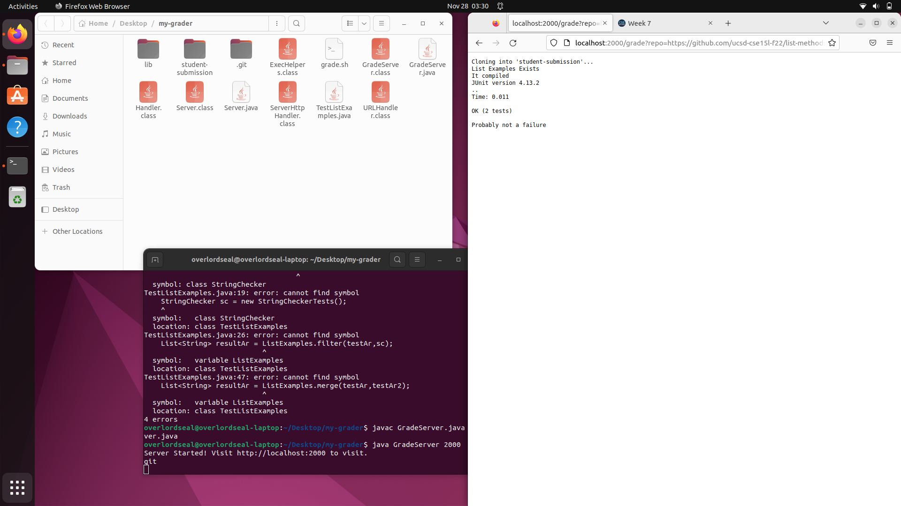
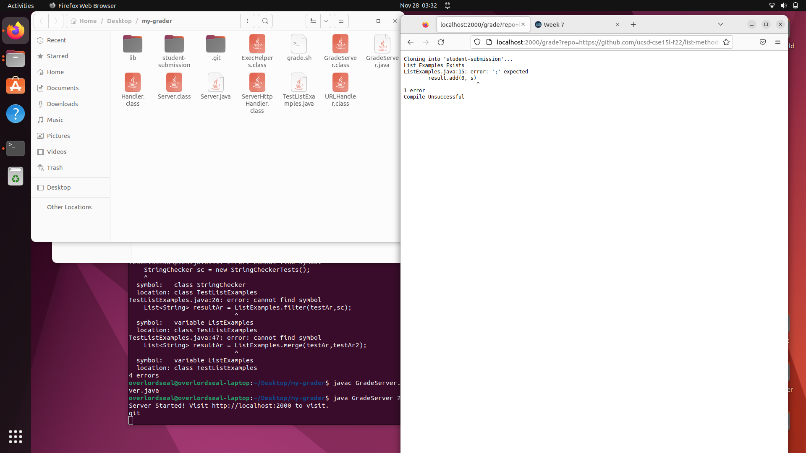
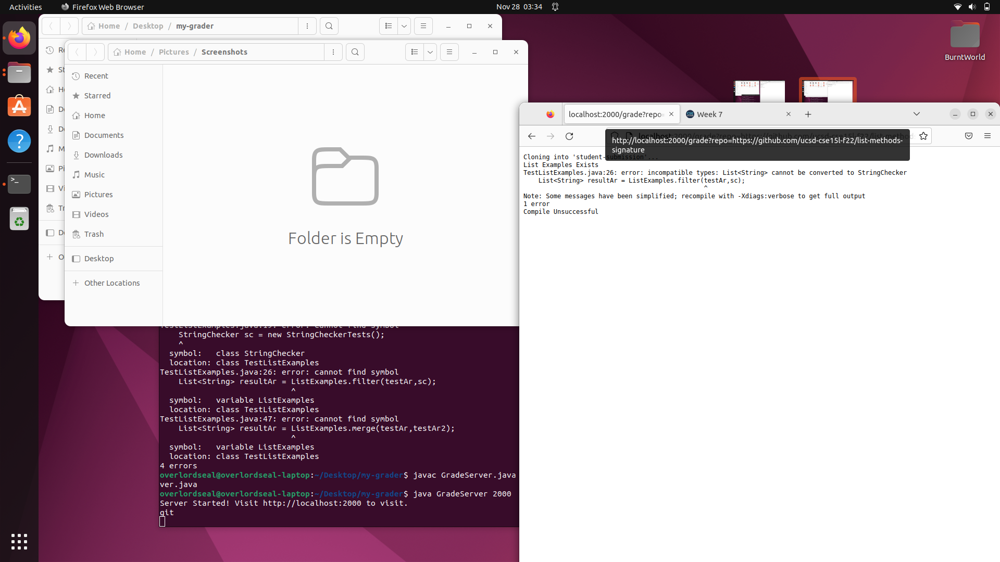

# Looking at autograders

For the past couple weeks we have asked the question of: "How does something like gradescope take a submission and know what to do with it?"

To answer this: We created our own grade scripts:

```
#!/bin/bash
# Create your grading script here
#set -e
CPATH=".:../lib/hamcrest-core-1.3.jar:../lib/junit-4.13.2.jar"
rm -rf student-submission
git clone $1 student-submission

cp TestListExamples.java student-submission/
# In student submission
cd student-submission

LISTFILE=`find ListExamples.java`
if [[ -e $LISTFILE ]]
then
    echo "List Examples Exists"
else
    echo "List Examples Doesn't Exist"
    exit 1
fi

javac -cp $CPATH *.java 
if [[ $? -ne 0 ]]
then
    echo "Compile Unsuccessful"
    exit 1
else
    echo "It compiled"
fi

java -cp $CPATH org.junit.runner.JUnitCore TestListExamples

if [[ $? -ne 0 ]]
then
    echo "Tests did not pass"
else
    echo "Probably not a failure"
fi

```

This is my grading script which goes through to find the students submission and utilize it for testing.
This will be demonstrated on 3 unique student examples: 

For: https://github.com/ucsd-cse15l-f22/list-methods-corrected,


The output here is probably not a failure, so the grading script is telling us the corrected version is passing.

For: https://github.com/ucsd-cse15l-f22/list-methods-compile-error, 


As we expect the grading script now outputs that the compile was just unsuccessful.

For: https://github.com/ucsd-cse15l-f22/list-methods-signature,


This also tells us that there is an error in the java code written. Which tells us there is an incompatible type, which makes sense for the methods signature git.

I will trace what happens in the successful script, so that I may go through the whole thing and explain as it goes along.

The entire output that we get for this repo is:
```
Cloning into 'student-submission'...
List Examples Exists
It compiled
JUnit version 4.13.2
..
Time: 0.011

OK (2 tests)

Probably not a failure
```

So the first lines below are responsible for initalizing the files we will be using

```
CPATH=".:../lib/hamcrest-core-1.3.jar:../lib/junit-4.13.2.jar"
rm -rf student-submission
git clone $1 student-submission
```

We are creating the variable CPATH that we will be using for the future, to make it easy for when it needs to be called upon.
`rm` will remove all the files from a folder called student-submission, since this could not be the first time running this, and we need to clean up from previous installs.
`git clone $1` takes our first parameter when running the script and treats it as a link to clone and put the code into the student-submission folder. In this case everything was printed into stdout as there we no errors, this also means an exit code of 0.

Below the test is copied and the terminal is moved to the newly downloaded folder.
```
cp TestListExamples.java student-submission/
# In student submission
cd student-submission
```

This first line will try to find any of the submissions given, as long as it's named ListExamples.java.

After that, if this file exists we just echo that it does, if it doesn't we echo it doesn't and exit with a code 1. In our case we simply echo that it does, since the git clone was successful and so was the copy.
```
LISTFILE=`find ListExamples.java`
if [[ -e $LISTFILE ]]
then
    echo "List Examples Exists"
else
    echo "List Examples Doesn't Exist"
    exit 1
fi
```

Now the java code is compiled with our class path we created eariler. We check the exitcode ($?) of the `javac` and it is not 0 (a failure) we echo that the compile didn't work out and exit with a code of one. In this case we compiled correctly so the only thing seen was in stdout with a "It compiled". If there were compiler errors, we would see those in the stderr line in our terminal.
```
javac -cp $CPATH *.java 
if [[ $? -ne 0 ]]
then
    echo "Compile Unsuccessful"
    exit 1
else
    echo "It compiled"
fi
```

Now we do almost the same thing as above, by doing the unit tests and checking the error code again. If the tests are not successful, we will see this is the Junit output as well, but we also echo based on the exit code as well. So in our case that we have, the tests went well and we see "Probably not a failure" in our terminal.

```
java -cp $CPATH org.junit.runner.JUnitCore TestListExamples

if [[ $? -ne 0 ]]
then
    echo "Tests did not pass"
else
    echo "Probably not a failure"
fi
```